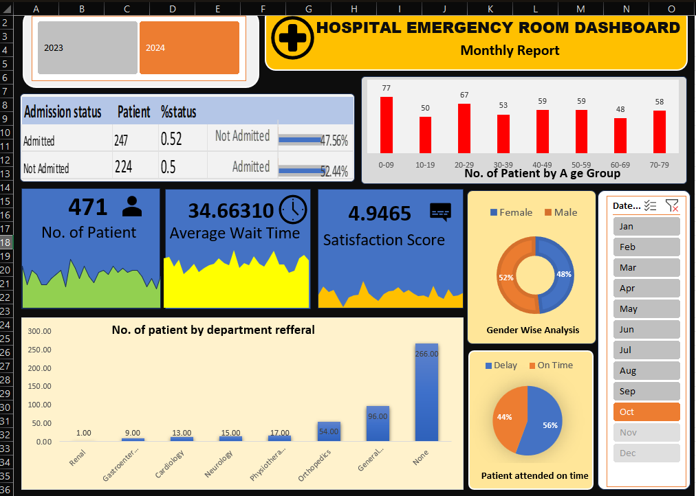

# 🏥 Hospital Emergency Room Dashboard – Excel

An interactive **Hospital Emergency Room Dashboard** built entirely in **Microsoft Excel**, visualizing patient data across 2023–2024 with dynamic filters, KPI cards, and multiple chart types.

---

##  Dashboard Preview



---

## Project Structure

```
hospital-er-dashboard-excel/
│
├── hospital.xlsx            # Main Excel file (Dashboard + Raw Data)
├── dashboard_preview.png    # Screenshot of the dashboard
└── README.md                # Project documentation
```

---

## 📌 About the Project

This dashboard was created to analyze and visualize emergency room data for a hospital covering the years **2023 and 2024**. It provides hospital administrators and analysts with a clear overview of patient flow, wait times, department referrals, and satisfaction scores — all in one interactive Excel sheet.

---

##  Dataset Overview

The raw dataset contains **9,216 patient records** with the following columns:

| Column | Description |
|--------|-------------|
| Patient Id | Unique patient identifier |
| Patient Admission Date | Date and time of ER visit |
| Patient First Initial | First initial of patient's name |
| Patient Last Name | Patient's last name |
| Patient Gender | Male / Female |
| Patient Age | Age of the patient |
| Patient Race | Patient's racial background |
| Department Referral | Department the patient was referred to |
| Patient Admission Flag | Whether patient was admitted (True/False) |
| Patient Satisfaction Score | Score given by patient (1–10) |
| Patient Wait Time | Time spent waiting (in minutes) |
| Patients CM | Case management flag |

---

##  Dashboard Features

###  KPI Cards
- **Total Patients:** 471
- **Average Wait Time:** 34.66 minutes
- **Satisfaction Score:** 4.95 / 10

### Charts & Visualizations
- **Admission Status Table** – Admitted (247, 52.44%) vs Not Admitted (224, 47.56%)
- **Patients by Age Group** – Bar chart across age ranges (0–9 to 70–79)
- **Gender Wise Analysis** – Pie chart: Female 52% / Male 48%
- **Department Referrals** – Bar chart showing referrals to Renal, Gastroenterology, Cardiology, Neurology, Physiotherapy, Orthopedics, General Practice, and None
- **Patient Attended On Time** – Pie chart: On Time 56% / Delay 44%
- **Trend Sparklines** – Mini area charts inside KPI cards for visual trend indication

###  Interactive Filter
- **Month Slicer** – Filter all charts and KPIs by month (Jan – Dec)
- **Year Comparison** – Toggle between 2023 and 2024 data

---

##  Tools & Techniques Used

- **Microsoft Excel**
- Pivot Tables & Pivot Charts
- Slicers (Month-based filtering)
- Bar Charts, Pie / Donut Charts
- Sparkline Area Charts
- Conditional Formatting
- KPI Card Design using shapes and text boxes
- Data from 2023–2024 (9,216 records)

---

##  How to Use

1. **Download** the `hospital.xlsx` file
2. **Open** it in Microsoft Excel (2016 or later recommended)
3. Go to the **Dashboard sheet**
4. Use the **Month Slicer** (Jan–Dec panel on the right) to filter data by month
5. Use the **Year buttons** (2023 / 2024) to switch between years
6. All charts and KPI cards will **update automatically**

---

##  Key Insights

- The **20–29 age group** has the highest ER visits (67 patients in the filtered view)
- **General Practice** is the most common department referral (266 patients)
- **56% of patients** were attended to on time; 44% experienced delays
- Female patients (52%) slightly outnumber male patients (48%)
- Average wait time of ~35 minutes indicates moderate ER load

---

##  Tags

`excel` `dashboard` `data-visualization` `healthcare` `hospital` `emergency-room` `pivot-table` `excel-dashboard` `data-analysis` `kpi`

---

##  Author

**Sanjana Sharma**
Student – Web Application Development & Data Science
Graphic Era Hill University, Bhimtal Campus

---

## 📄 License

This project is open source and available for educational use.

